

# Laporan Resmi Modul 1 Jaringan Komputer

## Anggota Kelompok

|Nama|NRP|
|--|--|
|Fazrul Ahmad Fadhillah|5027221025|
|Awang Fraditya|5027221055|

## Pengerjaan

### Evidence

Untuk mengetahui domain web yang diserang kami menggunakan filter `frame contains ".com"`

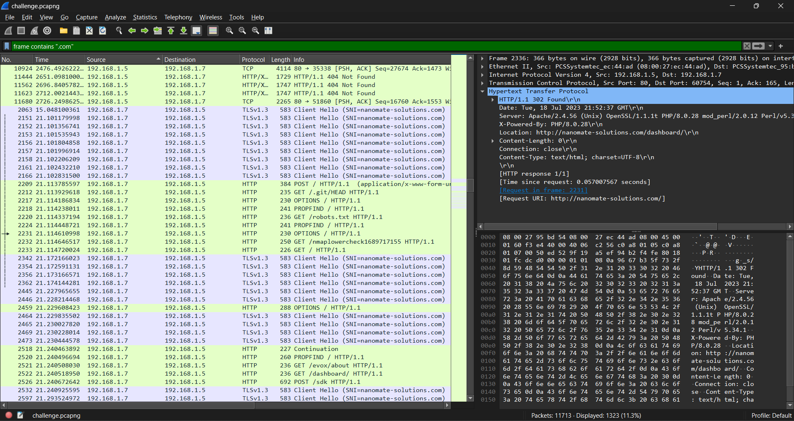

Terdapat nama domain web yang diserang yaitu **nanomate-solutions.com**. 

Untuk mendapatkan server dari web tersebut bisa dilihat dari salah satu packet HTTP, didapatkan packet tersebut berada dalam server **Apache/2.4.56**.

Untuk mengetahui path endpoint yang digunakan untuk login sebagai user biasa kami menggunakan filter `frame contains "login"`.

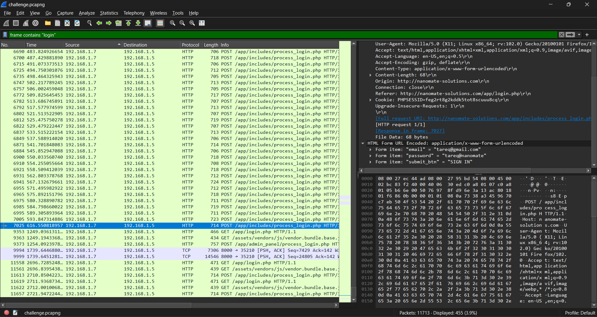

Dapat dilihat pada filter tersebut jika path endpoint untuk login sebagai user biasa adalah **/app/includes/process_login.php**.

Untuk mengetahui credentials yang digunakan untuk login sebagai user biasa kami menggunakan filter sesuai dengan path endpoint yang di *POST* yaitu `frame contains "/app/includes/process_login.php"` dan scroll kebawah.

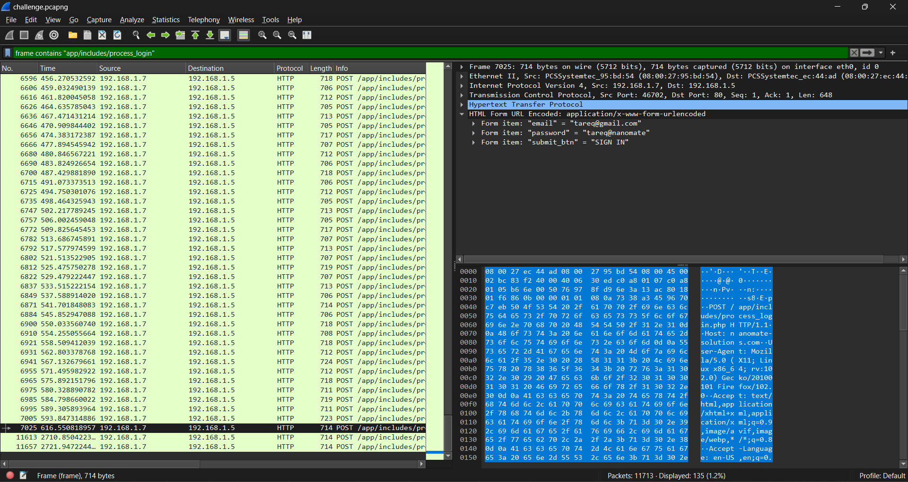

Didapat beberapa credentials seperti *someone@gmail.com* dan *tareq@gmail.com* dan kami mencoba follow stream packets packets tersebut. Didapat creds *tareq* berhasil untuk login sebagai berikut:

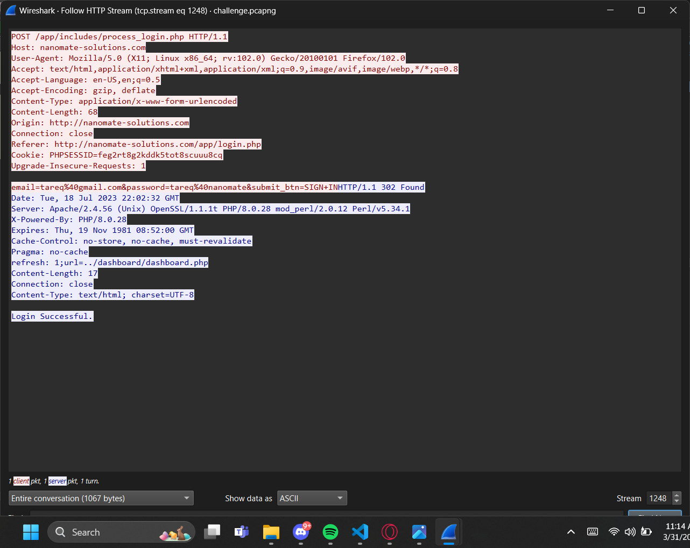

Didapat creds dengan email **tareq@gmail.com** dan password **tareq@nanomate**.

### Secret

Dengan menggunakan filter `tcp` dan melihat serta memfilter stream yang ada, kita bisa melihat file selain malware yang dikirim oleh attacker.

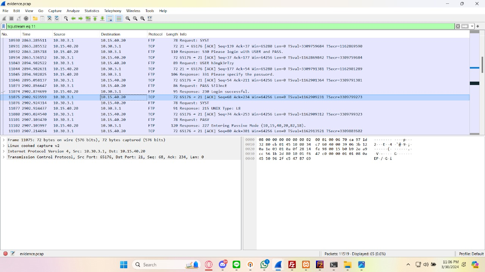

Di atas adalah stream di mana percakapan attacker mengirimkan file selain malware.

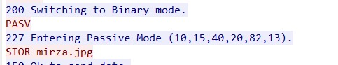

Di atas adalah bukti file yang dikirimkan oleh attacker ke korban.

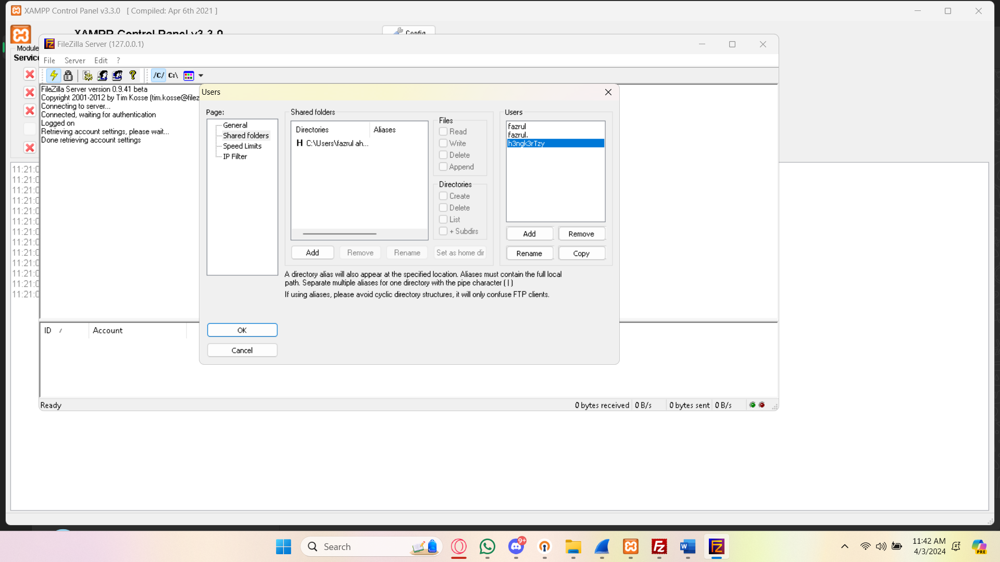

Setelah menemukan bukti filenya, buka server filezilla menggunakan xampp dan mengatur user sesuai dengan attacker dan setting dengan shared folder agar kita bisa mengakses folder attacker dan memindahkannya ke folder kita.

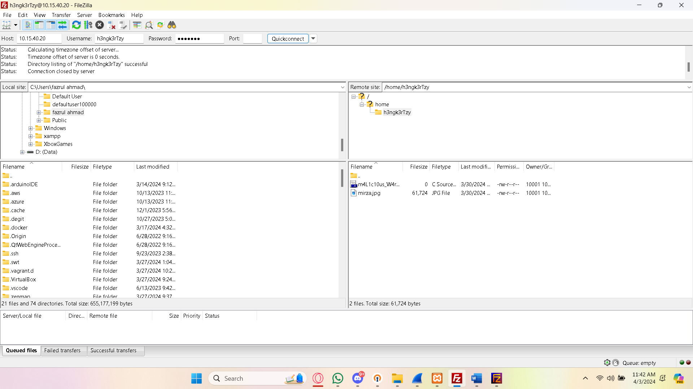

Setelah menghubungkan attacker di server filezilla, atur client filezilla sesuai dengan credential attackernya agar kita dapat mengakses folder attacker tersebut.

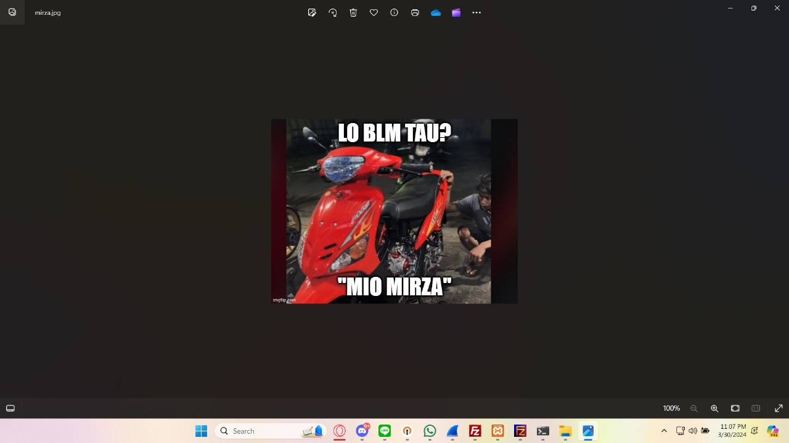

Ini adalah gambar yang dikirim oleh attacker dan di sini kata yang dikutip adalah **MIO MIRZA**.

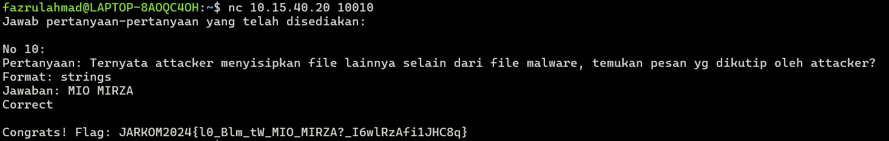

Lalu kita nc soalnya dan memasukkan jawaban dari pertanyaannya sehingga kita mendapatkan flag yang akan kita submit

### Creds

Dengan meggunakan filter `ftp` kita bisa mengidintifikasi packet - packet dan follow streamnya. Dari tcp stream terakhir flow dari packet - packet dan didapat credsnya adalah dengan username: **h3ngk3rTzy** dan password: **S!l3ncE**

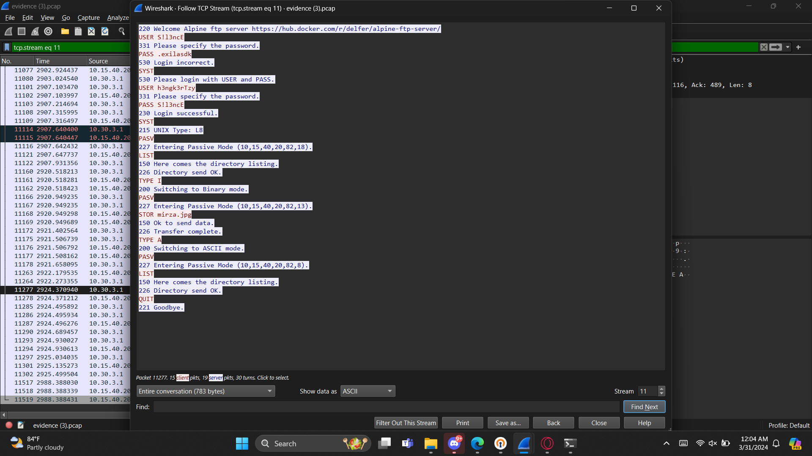

### Malwleowleo

Dengan menggunakan filter `ftp` didapat stream packet - packet, didalam stream tersebut dapat diidentifikasi bahwa ada pengiriman file yang mencurigakan yaitu **m4L1c10us_W4re.c**.

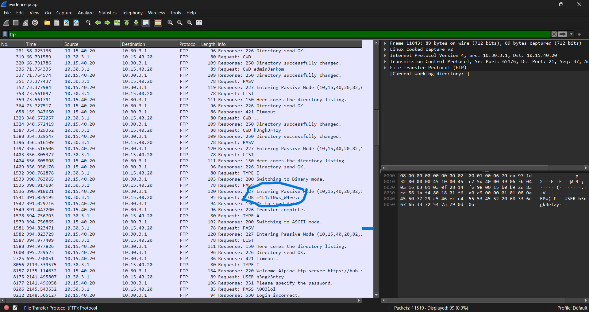

### Whoami?

Di dalam stream yang sama dengan *Creds* dan di dalam file *m4L1c10us_W4re.c* yang ditemukan dalam soal *Malwleowleo* terdapat string comment yang mencurigakan, yaitu *SGVsbG8gbXkgbmFtZSBpcyBQYXVsIEF0cmVpZGVzCg==*.

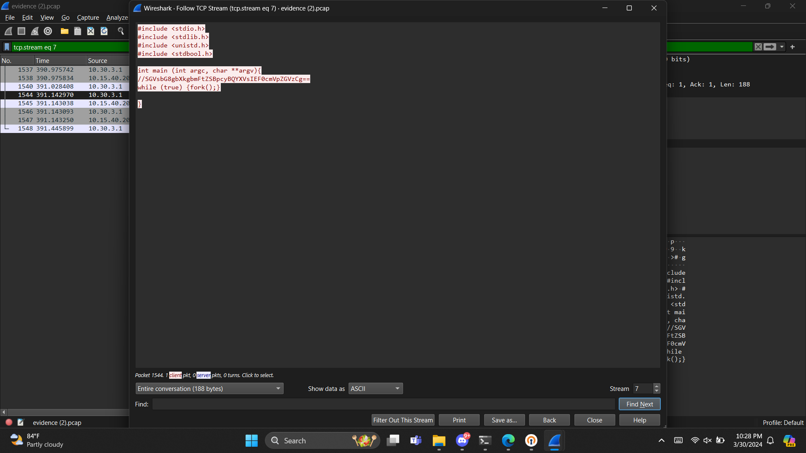

Kami menggunakan cipher identifier untuk mengetahui jenis enkripsi yang digunakan, dan didapat bahwa enkripsi yang digunakan adalaha *base 64*. Saat di decrypt kami mendapatkan string **Hello my name is Paul Atreides**. Dengan itu jawaban nya adalah **Paul_Atreides**.

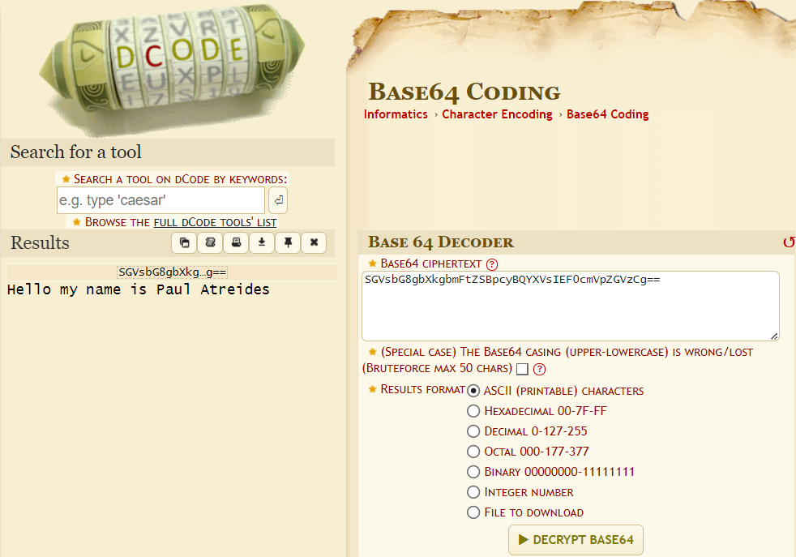

### ATM or ATP or FTP?

Untuk mendapatkan password yang berhasil didapatkan oleh si penyerang kita bisa track streamnya. Kami menggunakan filter `ftp` untuk mendapatkan stream packetnya, ditemukan sebuah packet Request yang mencurigakan dengan value *PASS m4y_th3_Kn!fe_ch1p_&_sh4tter*. Oleh karena itu password yang didaptkan adalah **m4y_th3_Kn!fe_ch1p_&_sh4tter**

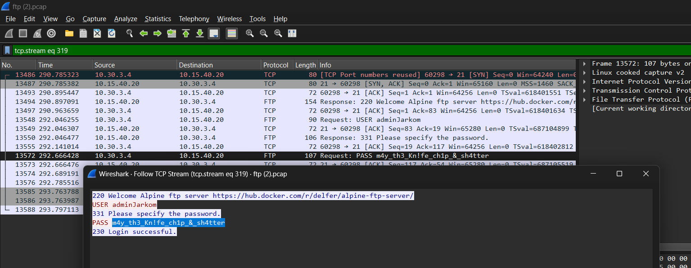

### How many packets?

Untuk mengetahui berapa banyak penyerang mencoba untuk login kami menggunakan filter `frame contains "Login"`

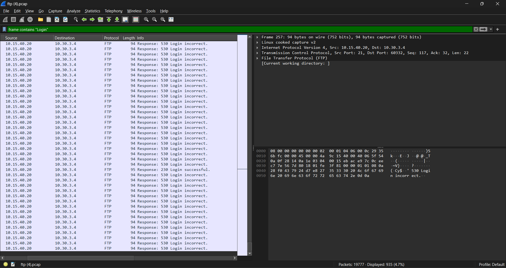

Pada kanan bawah terdapat jumlah packet yang terfilter, terlihat bahwa jumlah Login adalah 935x dengan 1x Login berhasil. Maka penyerang mencoba Login sebanyak **934x**

### Trace him

Alamat IP penyerang dapat terlihat ketika menggunakan filter `frame contains "login"`. Dapat terlihat packet yang dikirim dari web ke alamat IP si penyerang yaitu **10.30.3.4**

